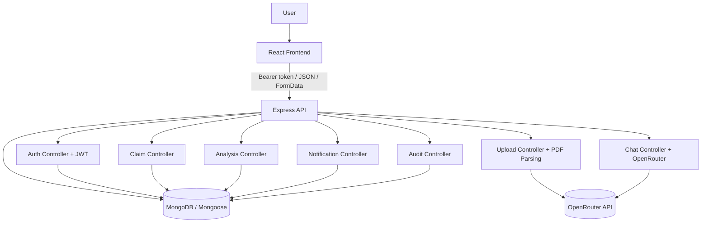
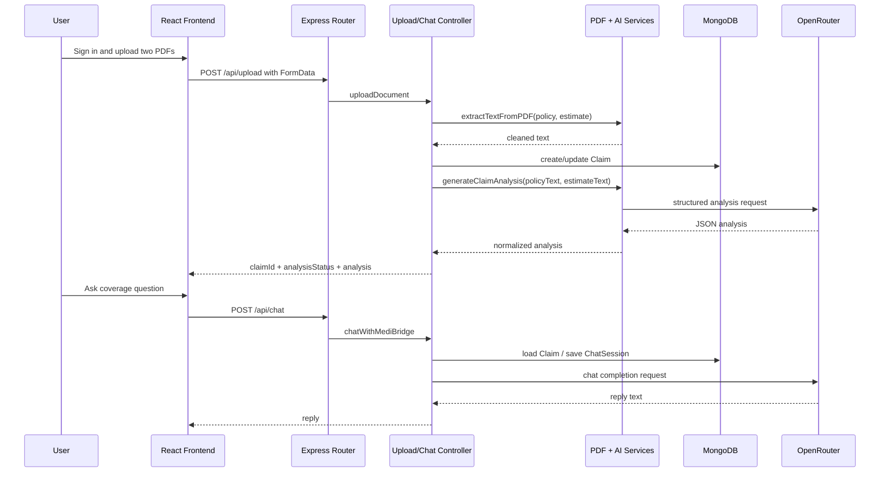

# High-Level Design

## 1. System Overview

MediBridge AI is a full-stack healthcare insurance assistant that helps a user upload an insurance policy PDF and a hospital estimate PDF, extract readable text, generate an AI-based claim overview, and ask follow-up questions in chat.

The implemented scope is centered on document-driven claim analysis. The codebase also includes claim workflows, role-protected routes, persistent chat sessions, notifications, and audit logging on the backend.

Primary users implemented in the UI and backend are:

- Patient
- Hospital user
- Insurer user

Major capabilities actually implemented:

- Email/password registration and login with JWT
- Protected API access using bearer tokens
- Upload of two PDF documents with validation
- PDF text extraction and claim analysis through OpenRouter
- Persistent chat sessions tied to a user and claim
- Claim status transitions for hospital verification and insurer decision
- Notifications and audit records on claim actions
- Dashboard metrics for patient, hospital, and insurer roles

## 2. Architecture Overview

The repository implements a classic client-server architecture:

- React frontend renders the authentication screens and the document-analysis workspace.
- Express backend exposes REST endpoints for auth, upload, chat, claims, dashboard metrics, notifications, and audit logs.
- MongoDB stores users, claims, chat sessions, notifications, audit records, and uploaded-document metadata.
- OpenRouter provides the AI model used for claim analysis and chat responses.
- File uploads are handled in memory by Multer and are not persisted to a cloud object store in the current codebase.

## 3. Technology Stack

| Technology | Version | Purpose | Where used |
|---|---:|---|---|
| React | 19.1.1 | Frontend UI | [src/](src) |
| React Router DOM | 6.20.0 | Client routing | [src/App.jsx](src/App.jsx), [src/components/ProtectedRoute.jsx](src/components/ProtectedRoute.jsx) |
| Vite | 7.0.4 | Frontend dev server and build tool | [src/vite.config.js](src/vite.config.js) |
| Recharts | 3.9.2 | Claim overview charts | [src/components/OverviewCards.jsx](src/components/OverviewCards.jsx) |
| Node.js / Express | 5.2.1 | REST API server | [server/server.js](server/server.js) |
| MongoDB / Mongoose | 9.6.3 | Data persistence and schemas | [server/models/](server/models) |
| JWT | 9.0.3 | Access token signing and verification | [server/controllers/authController.js](server/controllers/authController.js), [server/middlewear/authMiddlewear.js](server/middlewear/authMiddlewear.js) |
| bcryptjs | 3.0.3 | Password hashing and comparison | [server/controllers/authController.js](server/controllers/authController.js) |
| Multer | 2.2.0 | Multipart file upload handling | [server/middlewear/uploadMiddleware.js](server/middlewear/uploadMiddleware.js) |
| pdf-parse | 2.4.5 | PDF text extraction | [server/services/pdfService.js](server/services/pdfService.js) |
| OpenRouter API | n/a | AI model endpoint | [server/services/openaiService.js](server/services/openaiService.js), [server/services/claimAnalysisService.js](server/services/claimAnalysisService.js) |
| dotenv | 17.4.2 | Environment configuration | [server/config/loadEnv.js](server/config/loadEnv.js) |
| cors | 2.8.5 | Cross-origin requests | [server/server.js](server/server.js) |

## 4. System Components

### Frontend

The frontend is a React application with three actual routes: login, register, and a protected dashboard route that renders the upload-and-analysis workspace. The dashboard page itself is implemented as [src/pages/Upload.jsx](src/pages/Upload.jsx).

Responsibilities:

- Authenticate the user and store the token in localStorage
- Upload two PDF files
- Show claim analysis metrics and charts
- Render chat history and send follow-up questions
- Load previous chat sessions from the backend

### Backend

The backend is an Express application that mounts route modules for auth, claims, upload, dashboard analytics, notifications, audit logs, and chat.

Responsibilities:

- Validate tokens and roles
- Receive multipart uploads
- Extract PDF text
- Call OpenRouter for analysis and chat responses
- Persist claims, sessions, notifications, and audit logs

### AI Service

The AI layer is implemented through OpenRouter calls in [server/services/openaiService.js](server/services/openaiService.js) and [server/services/claimAnalysisService.js](server/services/claimAnalysisService.js).

Responsibilities:

- Build strict prompts from policy text, estimate text, and the user question
- Return a chat response for the user
- Return structured JSON for claim analysis

### Database

MongoDB stores application data through Mongoose models.

Collections currently implemented in code:

- User
- Claim
- ChatSession
- Notification
- AuditLog
- Document

### File Upload Module

The upload module validates PDF type and size, stores the uploaded files in memory, extracts text, and creates or updates a claim record.

Important detail:

- Cloudinary integration files exist, but the current upload path does not write uploaded files to Cloudinary or any other object store.

### Authentication

Authentication uses bcrypt password hashing, JWT access tokens, and middleware that loads the current user into `req.user`.

## 5. Feature Mapping

| Feature | Purpose | Components involved | APIs used | Database collections | AI involvement |
|---|---|---|---|---|---|
| Authentication | Register and log in users | Login page, Register page, auth controller, auth middleware, User model | `POST /api/auth/register`, `POST /api/auth/login`, `GET /api/auth/me` | User | None |
| PDF upload and extraction | Accept two PDFs and convert them to text | Upload page, DocumentCard, upload middleware, pdf service, upload controller | `POST /api/upload`, `POST /api/upload/:claimId/analyze`, `GET /api/upload/:claimId` | Claim, Document | Yes, for analysis |
| Claim overview generation | Produce cost, clarity, flags, readiness, and next action | Upload page, OverviewCards, claim analysis service | `POST /api/upload`, `POST /api/upload/:claimId/analyze` | Claim | Yes |
| Chat assistant | Answer follow-up questions about uploaded documents | ChatPanel, chat controller, OpenRouter service, ChatSession model | `POST /api/chat`, `GET /api/chat/sessions`, `GET /api/chat/:claimId/history` | ChatSession, Claim | Yes |
| Claim workflow | Track submission, verification, and decision | claim controller, claim routes, notification service, audit service, Claim model | `POST /api/claims`, `PATCH /api/claims/:id/verify`, `PATCH /api/claims/:id/decision` | Claim, Notification, AuditLog | Indirect only |
| Role dashboards | Show role-specific counts | analysis controller | `GET /api/dashboard/patient`, `GET /api/dashboard/hospital`, `GET /api/dashboard/insurer` | Claim | None |
| Notifications | Persist system notifications for claim changes | notification controller, notification service, Notification model | `GET /api/notifications`, `PATCH /api/notifications/:id/read` | Notification | None |
| Audit logs | Record claim actions | audit controller, audit service, AuditLog model | `GET /api/audit`, `GET /api/audit/:claimId` | AuditLog | None |

## 6. End-to-End Data Flow

The main implemented flow is document upload followed by AI analysis and chat.

1. The user signs in and receives a JWT.
2. The user opens the dashboard and selects two PDF files.
3. The frontend sends the files as multipart form data to the upload API.
4. Multer validates the file types and file sizes in memory.
5. The backend extracts text from both PDFs.
6. The backend creates or updates a claim record in MongoDB.
7. The backend sends the policy text and estimate text to OpenRouter for structured analysis.
8. The normalized AI result is saved on the claim.
9. The frontend renders the analysis cards and chart.
10. When the user asks a question, the frontend posts the claim ID and message to the chat API.
11. The backend loads the claim, builds a prompt, calls OpenRouter, saves the conversation in ChatSession, and returns the reply.

## 7. Deployment Architecture

The repository does not include Dockerfiles, Kubernetes manifests, or CI/CD pipeline definitions. The deployment model is therefore conventional rather than codified in the repo.

Implemented build/runtime behavior:

- Frontend uses Vite and can be built with `npm run build` from the frontend package.
- Backend runs directly with Node.js using `node server.js` or `npm start` from the server package.
- MongoDB connection is configured through `MONGO_URI`.
- Authentication and AI integrations are configured through environment variables.

Operationally, the current code assumes:

- A browser-hosted React frontend
- A Node.js backend reachable over HTTP
- A MongoDB database accessible from the backend process
- OpenRouter network access from the backend process

## 8. Scalability Considerations

Realistic improvements for the current architecture are:

- Add proper object storage for uploaded PDFs instead of in-memory-only handling.
- Introduce pagination for claims, sessions, audit logs, and notifications.
- Add indexes on claim query fields used for filtering and search.
- Move OpenRouter calls to a background job queue if response times grow.
- Add caching for dashboard counters if data volume increases.
- Persist frontend session state only as a convenience, not as the primary source of truth.
- Add automated tests for middleware, controllers, and service-level normalization.

## 9. Security Overview

Implemented security features:

- Passwords are hashed with bcrypt before storage.
- JWT tokens are issued with a 7-day expiry.
- Protected backend routes require bearer tokens.
- Role-based middleware blocks unauthorized claim actions.
- Upload middleware rejects non-PDF files and caps each file at 10 MB.
- PDF extraction rejects empty or non-text-based files.

Security trade-offs visible in the implementation:

- `cors()` is enabled without a restrictive origin list.
- The frontend route guard only checks for a stored token; it does not validate the token with the server before rendering.

## 10. Risks and Limitations

The following limitations are visible in the codebase and should be treated as current system constraints:

- [server/controllers/claimController.js](server/controllers/claimController.js) references `Claim` but does not import it, which would break claim handlers at runtime.
- The upload path does not write files to Cloudinary or another durable object store even though related files exist.
- [server/services/openaiService.js](server/services/openaiService.js) accepts a history argument, but the current prompt does not include prior chat turns.
- The frontend exposes no dedicated notifications or audit-log screens.
- [src/pages/Dashboard.jsx](src/pages/Dashboard.jsx) and several component files are empty stubs.
- Role-aware frontend routing is not implemented; only token presence is checked on the client.
- Claims created by the upload flow do not set patient, hospital, or insurer ownership fields.
- OCR for scanned documents is not implemented; the PDF parser requires extractable text.
- There is no repository-managed deployment configuration.
