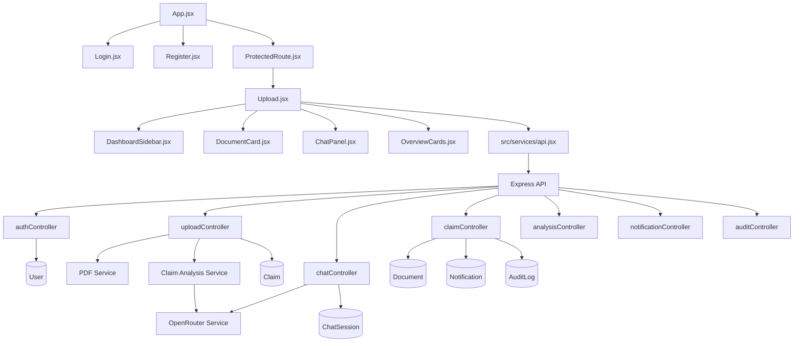

# Low-Level Design

## 1. Folder Structure

### Root

- `TRD.md`: original technical/product intent document.
- `HLD.md`: high-level architecture and feature mapping.
- `LLD.md`: implementation-level documentation.
- `Medibridge/`: application source tree.

### `Medibridge/server/`

Backend implementation based on Express and Mongoose.

- `server.js`: backend bootstrap, middleware registration, route mounting, and server start.
- `config/`: environment loading, MongoDB connection, and system prompt text.
- `controllers/`: request handlers for auth, upload, claims, chat, notifications, audit, and dashboard metrics.
- `middlewear/`: authentication and upload middleware. The folder name is spelled `middlewear` in the repository.
- `models/`: Mongoose schemas for persisted entities.
- `routes/`: Express routers that map HTTP endpoints to controllers.
- `services/`: reusable service functions for PDF parsing, OpenRouter calls, analysis normalization, notifications, and audit logging.
- `scripts/`: present but unused in the inspected implementation.
- `utils/`: present but not populated in the inspected files.

### `Medibridge/src/`

Frontend React application.

- `main.jsx`: browser entry point.
- `App.jsx`: route definitions.
- `pages/`: login, register, and upload workspace pages.
- `components/`: reusable UI pieces such as the sidebar, chat panel, document cards, and analysis cards.
- `services/`: frontend API wrapper.
- `styles.css`: global and component styling.
- `vite.config.js`: Vite configuration.

## 2. Frontend Design

### `Login.jsx`

Purpose:

- Authenticate an existing user.

Components used:

- Native form controls only.

Hooks:

- `useState` for email, password, error, and loading state.
- `useNavigate` for redirect after login.

State:

- Email input
- Password input
- Error message
- Loading flag

API calls:

- `POST /api/auth/login`

Navigation:

- Redirects to `/dashboard` on success.

Dependencies:

- Browser `localStorage` for token and user storage.

### `Register.jsx`

Purpose:

- Create a new account and immediately log the user in.

Components used:

- Native form controls only.

Hooks:

- `useState` for name, email, password, role, error, and loading.
- `useNavigate` for redirect after registration.

State:

- Name, email, password, and role inputs
- Error message
- Loading flag

API calls:

- `POST /api/auth/register`
- `POST /api/auth/login`

Navigation:

- Redirects to `/dashboard` after successful registration and login.

Dependencies:

- Browser `localStorage` for token and user storage.

### `Upload.jsx`

Purpose:

- Main working surface for document upload, claim overview, analysis retry, chat, and session switching.

Components used:

- [DashboardSidebar](src/components/DashboardSidebar.jsx)
- [DocumentCard](src/components/DocumentCard.jsx)
- [ChatPanel](src/components/ChatPanel.jsx)
- [ClaimMetricCard](src/components/OverviewCards.jsx)
- [CostBreakdownChart](src/components/OverviewCards.jsx)
- [CoverageClarityCard](src/components/OverviewCards.jsx)
- [CoverageFlagsCard](src/components/OverviewCards.jsx)
- [ClaimReadinessCard](src/components/OverviewCards.jsx)
- [NextActionCard](src/components/OverviewCards.jsx)

Hooks:

- `useState` for session, upload, analysis, and chat state.
- `useEffect` for persistence, keyboard handling, and initial data loading.
- `useRef` for file inputs and chat input focus.
- `useCallback` for session loading and message-history loading.

State:

- Active claim session
- Sidebar session list
- Chat messages and input text
- Upload state for policy and estimate PDFs
- Loading and error flags for upload, chat, and analysis
- Expanded chat mode flag

API calls:

- `fetchChatSessions()`
- `fetchChatHistory(claimId)`
- `uploadClaimDocuments({ policyFile, estimateFile, claimId })`
- `retryClaimAnalysis(claimId)`
- `sendChatMessage({ claimId, message })`

Navigation:

- No route changes from the page itself; it behaves as the `/dashboard` view.

Dependencies:

- `localStorage` key `medibridgeClaimSession` for restoring the active claim view.
- `Escape` key closes expanded chat mode.

### `Dashboard.jsx`

Purpose:

- Present in the repo, but empty and unused by routing.

### `ProtectedRoute.jsx`

Purpose:

- Client-side token guard around the dashboard route.

Hooks:

- None.

State:

- Reads token from `localStorage`.

Behavior:

- Redirects to `/login` when no token is stored.

Limitation:

- It does not verify token validity with the server.

### `ChatPanel.jsx`

Purpose:

- Render the conversation stream and message composer.

Hooks:

- `useEffect` for auto-scrolling to the latest message.
- `useRef` for the scroll sentinel.

State:

- State is owned by the parent `Upload.jsx`.

Event handlers:

- Sends the form submit event back to the parent.
- Expands or collapses the chat shell.

API interaction:

- No direct API calls. It delegates to the parent page.

### `DashboardSidebar.jsx`

Purpose:

- Show stored chat sessions and provide a new-chat action.

State:

- No local state.

Event handlers:

- `onSelectSession(session)`
- `onNewChat()`

### `DocumentCard.jsx`

Purpose:

- Present one file input card for policy or estimate upload.

State:

- No local state.

Event handlers:

- `onSelect`
- `onClick`

Validation:

- Accepts only PDF files in the browser input.

### `OverviewCards.jsx`

Purpose:

- Render the analysis cards and the cost chart.

Important exported items:

- `ClaimMetricCard`
- `CostBreakdownChart`
- `CoverageClarityCard`
- `CoverageFlagsCard`
- `ClaimReadinessCard`
- `NextActionCard`
- `formatCurrency`
- `formatScore`

Behavior notes:

- Chart labels are compacted to reduce overlap.
- Coverage flags display only the first three items and show a `View all` button without a handler.
- `NextActionCard` can trigger chat-prefill via `onAskAboutThis`.

## 3. Component Design

### `ChatPanel`

Purpose:

- Host the message list, composer, expand button, and disclaimer.

Props:

- `claimReady`
- `isChatExpanded`
- `onToggleExpand`
- `messages`
- `input`
- `onInputChange`
- `onSubmit`
- `chatError`
- `isSending`
- `inputRef`

Internal state:

- None.

Lifecycle:

- Scrolls to the bottom whenever `messages` changes.

Event handlers:

- Submit form
- Toggle expansion

### `DashboardSidebar`

Purpose:

- Display the session list and new chat action.

Props:

- `sessions`
- `activeClaimId`
- `onSelectSession`
- `onNewChat`

Internal state:

- None.

Event handlers:

- Select a stored session.
- Create a new blank chat session in the parent state.

### `DocumentCard`

Purpose:

- Present a single upload target.

Props:

- `label`
- `fileName`
- `fileSize`
- `processed`
- `inputRef`
- `onSelect`
- `error`
- `onClick`

Internal state:

- None.

Event handlers:

- Click to trigger the hidden file input.
- Change to select a PDF.

### `OverviewCards` components

Purpose:

- Show analysis metrics, charts, and recommendations.

Props:

- Vary by component, all derived from `analysis` or `flags` input.

Internal state:

- None.

API interaction:

- None.

## 4. Backend Design

### Route-to-controller mapping

- Auth routes map to `registerUser`, `loginUser`, and `getCurrentUser`.
- Claim routes map to claim creation, listing, verification, decision, and document retrieval.
- Upload routes map to upload, analysis retry, and document retrieval.
- Analysis routes map to dashboard counters.
- Notification routes map to list and mark-read handlers.
- Audit routes map to list and claim-trail handlers.
- Chat routes map to send-message, list sessions, and fetch history handlers.

### Controller responsibilities

- `authController.js`: register, login, and return current user.
- `uploadController.js`: validate claim ID, extract PDF text, create/update claim, run AI analysis.
- `chatController.js`: create or fetch sessions, send prompts to OpenRouter, store message history, return chat history and sessions.
- `claimController.js`: create claims, filter claims, fetch a claim, verify a claim, decide a claim, and fetch related documents.
- `analysisController.js`: compute role-based dashboard summary counts.
- `notificationController.js`: list notifications and mark them as read.
- `auditController.js`: list audit logs and claim trails.

### Service responsibilities

- `pdfService.js`: parse and clean text from a PDF buffer.
- `claimAnalysisService.js`: call OpenRouter for JSON analysis and normalize the response shape.
- `openaiService.js`: build prompts and call OpenRouter for chat completions.
- `notificationService.js`: create notification records and suppress failures.
- `auditService.js`: create audit log records and suppress failures.

### Middleware responsibilities

- `authMiddlewear.js`: validate JWT bearer token and load `req.user`.
- `authorize(...)`: enforce role-based access.
- `uploadMiddleware.js`: enforce PDF-only uploads, 10 MB per file, and exactly one policy plus one estimate file.

## 5. API Design

| Method | Endpoint | Purpose | Request Body | Response | Status Codes | Files Responsible |
|---|---|---|---|---|---|---|
| POST | `/api/auth/register` | Create user | `name`, `email`, `password`, `role` | User object and message | 201, 400, 500 | [server/controllers/authController.js](server/controllers/authController.js) |
| POST | `/api/auth/login` | Authenticate user | `email`, `password` | `token`, `user` | 200, 401, 500 | [server/controllers/authController.js](server/controllers/authController.js) |
| GET | `/api/auth/me` | Return current user | None | Authenticated user | 200, 401 | [server/controllers/authController.js](server/controllers/authController.js), [server/middlewear/authMiddlewear.js](server/middlewear/authMiddlewear.js) |
| POST | `/api/upload` | Upload PDFs and run analysis | Multipart `policy`, `estimate`, optional `claimId` | Claim ID, filenames, analysis, status | 200, 201, 400, 413, 422, 500 | [server/controllers/uploadController.js](server/controllers/uploadController.js), [server/middlewear/uploadMiddleware.js](server/middlewear/uploadMiddleware.js) |
| POST | `/api/upload/:claimId/analyze` | Retry analysis for existing claim | None | Analysis result and status | 200, 400, 404, 502, 500 | [server/controllers/uploadController.js](server/controllers/uploadController.js) |
| GET | `/api/upload/:claimId` | Fetch documents for a claim | None | Documents array | 200, 403, 404, 500 | [server/controllers/uploadController.js](server/controllers/uploadController.js) |
| POST | `/api/claims` | Create a claim | Treatment, diagnosis, amount, optional ownership and analysis fields | Created claim | 201, 400, 500 | [server/controllers/claimController.js](server/controllers/claimController.js) |
| GET | `/api/claims/my` | Patient claims | None | Claims array | 200, 403, 500 | [server/controllers/claimController.js](server/controllers/claimController.js) |
| GET | `/api/claims` | List claims for hospital/insurer | Query filters | Claims array | 200, 403, 500 | [server/controllers/claimController.js](server/controllers/claimController.js) |
| GET | `/api/claims/:id` | Fetch one claim | None | Claim object | 200, 403, 404, 500 | [server/controllers/claimController.js](server/controllers/claimController.js) |
| PATCH | `/api/claims/:id/verify` | Mark claim verified | None | Updated claim | 200, 400, 404, 500 | [server/controllers/claimController.js](server/controllers/claimController.js) |
| PATCH | `/api/claims/:id/decision` | Approve or reject claim | `decision`, `reason` | Updated claim | 200, 400, 404, 500 | [server/controllers/claimController.js](server/controllers/claimController.js) |
| GET | `/api/claims/:id/documents` | Fetch documents for a claim | None | Documents array | 200, 403, 404, 500 | [server/controllers/claimController.js](server/controllers/claimController.js) |
| GET | `/api/dashboard/patient` | Patient dashboard counts | None | Claim counts and recent claims | 200, 500 | [server/controllers/analysisController.js](server/controllers/analysisController.js) |
| GET | `/api/dashboard/hospital` | Hospital dashboard counts | None | Claim counts | 200, 500 | [server/controllers/analysisController.js](server/controllers/analysisController.js) |
| GET | `/api/dashboard/insurer` | Insurer dashboard counts | None | Claim counts | 200, 500 | [server/controllers/analysisController.js](server/controllers/analysisController.js) |
| GET | `/api/notifications` | List user notifications | None | Notifications array | 200, 500 | [server/controllers/notificationController.js](server/controllers/notificationController.js) |
| PATCH | `/api/notifications/:id/read` | Mark notification read | None | Notification object | 200, 404, 500 | [server/controllers/notificationController.js](server/controllers/notificationController.js) |
| GET | `/api/audit` | List audit logs | Query filters | Logs array | 200, 500 | [server/controllers/auditController.js](server/controllers/auditController.js) |
| GET | `/api/audit/:claimId` | Claim audit trail | None | Logs array | 200, 404, 500 | [server/controllers/auditController.js](server/controllers/auditController.js) |
| POST | `/api/chat` | Generate chat reply and persist session | `claimId`, `message` | Reply string | 200, 400, 404, 502, 500 | [server/controllers/chatController.js](server/controllers/chatController.js) |
| GET | `/api/chat/sessions` | List sessions for sidebar | None | Sessions array | 200, 500 | [server/controllers/chatController.js](server/controllers/chatController.js) |
| GET | `/api/chat/:claimId/history` | Get one session history | None | Messages array and session metadata | 200, 400, 500 | [server/controllers/chatController.js](server/controllers/chatController.js) |

## 6. Database Design

### `User`

Fields:

- `name`: string, required, trimmed
- `email`: string, required, unique, lowercase
- `password`: string, required
- `role`: enum `patient | hospital | insurer`, default `patient`

Validation/defaults:

- Email uniqueness is enforced at the schema level.
- Role is restricted to three values.

Indexes:

- Unique index on email via schema option.

### `Claim`

Fields:

- Ownership: `patientId`, `hospitalId`, `insurerId`, `verifiedBy`, `reviewedBy`
- Claim details: `treatment`, `diagnosis`, `amount`, `coverageAmount`, `patientResponsibility`, `missingDocuments`, `confidenceScore`
- Workflow: `status`, `statusHistory`, `decisionReason`, `verifiedAt`, `reviewedAt`
- Document text: `policyText`, `hospitalEstimateText`, `policyFileName`, `estimateFileName`
- Analysis state: `analysisStatus`, `analysisError`, `analysis`

Validation/defaults:

- `status` defaults to `submitted`.
- `analysisStatus` defaults to `pending`.
- `confidenceScore` is bounded between 0 and 100.
- `status` and status-history entries use a fixed enum.
- Analysis fields default to null/empty strings as appropriate.

Relationships:

- References `User` for ownership and review fields.

Indexes:

- No explicit indexes beyond default Mongoose behavior are defined in the file.

### `ChatSession`

Fields:

- `claimId`: reference to Claim
- `userId`: reference to User
- `sessionName`: string, default `Claim Session`
- `messages`: array of `{ role, content }`
- `lastMessageAt`: date

Validation/defaults:

- `role` is restricted to `user | assistant | system`.

Relationships:

- One session belongs to one user and one claim.

Indexes:

- Unique compound index on `userId + claimId`.

### `Notification`

Fields:

- `recipientId`, `senderId`, `claimId`, `type`, `title`, `message`, `read`

Validation/defaults:

- `type` is limited to claim/document/system categories.
- `read` defaults to `false`.

Relationships:

- References User and Claim.

### `AuditLog`

Fields:

- `actorId`, `actorRole`, `action`, `entityType`, `entityId`, `claimId`, `metadata`

Validation/defaults:

- `entityId` uses `refPath`, so it resolves to the model named in `entityType`.

Relationships:

- References User and Claim, with dynamic target resolution for `entityId`.

### `Document`

Fields:

- `claimId`, `uploadedBy`, `fileName`, `fileUrl`, `fileType`, `notes`, `source`

Validation/defaults:

- `source` defaults to `manual`.

Relationships:

- References Claim and User.

Implementation note:

- No backend write path currently creates `Document` records.

### Empty models

- `Policy`
- `Estimate`
- `Analysis`

These files exist but contain no schema definitions in the inspected repository.

## 7. Request Lifecycle

### Authentication

1. Client posts credentials to `/api/auth/login` or registration data to `/api/auth/register`.
2. Controller validates basic conditions and uses Mongoose to look up or create the user.
3. Passwords are hashed or compared with bcrypt.
4. Login returns a JWT and sanitized user object.
5. Protected routes verify the bearer token in middleware and load `req.user`.

### Document upload and analysis

1. Browser submits a multipart request with `policy` and `estimate` files.
2. Upload middleware rejects non-PDF files and large files.
3. Controller extracts text from each buffer.
4. Claim record is created or updated with file names and extracted text.
5. Claim analysis service calls OpenRouter for strict JSON output.
6. The JSON is normalized and stored on the claim.
7. The response returns analysis state and claim ID to the frontend.

### Chat request

1. Browser posts `claimId` and `message`.
2. Controller validates both fields and loads the claim.
3. A chat session is created if needed for the `(userId, claimId)` pair.
4. The prompt is sent to OpenRouter.
5. The assistant reply is stored in the session along with the user message.
6. The reply is returned to the frontend.

### Claim verification/decision

1. Authorized hospital or insurer calls the relevant claim route.
2. Controller loads the claim and validates the target status change.
3. Claim status is updated and appended to `statusHistory`.
4. Notification and audit services are invoked.
5. The updated claim is returned.

## 8. AI Workflow

### Claim analysis workflow

1. The upload controller calls `generateClaimAnalysis` with extracted policy and estimate text.
2. The service builds a system message containing a strict JSON schema and anti-hallucination rules.
3. OpenRouter is called with the configured model or the default free Gemma model.
4. The response is stripped of code fences and parsed as JSON.
5. Numbers, strings, enum values, and scores are normalized before persistence.

Limitations:

- The parser expects valid JSON. If OpenRouter returns malformed JSON, the request fails.
- If either text is missing or too short, analysis is not attempted.

### Chat workflow

1. The chat controller builds a prompt from the current claim text and the user question.
2. OpenRouter returns a text response.
3. The message is persisted to `ChatSession`.

Limitations:

- The service accepts a `history` parameter but does not currently inject prior turns into the prompt.

## 9. Error Handling

### Client-side

- Login and register screens show inline error messages.
- Upload page surfaces upload, analysis, and chat errors.
- File inputs reject non-PDF selections before submission.

### Server-side

- Controllers use try/catch and return HTTP status codes.
- Upload controller maps invalid PDF and extraction failures to specific codes.
- OpenRouter failures are mapped to `502` when the upstream service is down or rejects the request.

### API failures

- Frontend API wrappers read the JSON message field and raise an Error when the response is not OK.

### Database failures

- Notification and audit write helpers swallow their own errors and return null after logging.

### AI failures

- Claim analysis returns `failed` status and stores the error message on the claim.
- Chat request returns `502` for upstream errors that match OpenRouter/network conditions.

## 10. Environment Variables

| Variable | Used in | Purpose |
|---|---|---|
| `PORT` | [server/server.js](server/server.js) | Backend listen port |
| `MONGO_URI` | [server/config/db.js](server/config/db.js) | MongoDB connection string |
| `JWT_SECRET` | [server/controllers/authController.js](server/controllers/authController.js), [server/middlewear/authMiddlewear.js](server/middlewear/authMiddlewear.js) | JWT signing and verification secret |
| `OPENROUTER_API_KEY` | [server/services/openaiService.js](server/services/openaiService.js) | OpenRouter authentication |
| `OPENROUTER_MODEL` | [server/services/openaiService.js](server/services/openaiService.js), [server/services/claimAnalysisService.js](server/services/claimAnalysisService.js) | AI model identifier |
| `VITE_API_BASE_URL` | [src/services/api.jsx](src/services/api.jsx), [src/pages/Login.jsx](src/pages/Login.jsx), [src/pages/Register.jsx](src/pages/Register.jsx) | Frontend API base URL |

## 11. File-Level Responsibilities

| File | Purpose | Depends On | Used By |
|---|---|---|---|
| [server/server.js](server/server.js) | Boot Express app and mount routes | config, routes | Node entry point |
| [server/config/db.js](server/config/db.js) | Connect to MongoDB | mongoose | server bootstrap |
| [server/config/loadEnv.js](server/config/loadEnv.js) | Load `.env` | dotenv | server bootstrap |
| [server/config/systemPrompt.js](server/config/systemPrompt.js) | Shared AI system prompt | none | openai service |
| [server/middlewear/authMiddlewear.js](server/middlewear/authMiddlewear.js) | JWT auth and role enforcement | jwt, User | routes |
| [server/middlewear/uploadMiddleware.js](server/middlewear/uploadMiddleware.js) | Multer PDF validation | multer | upload routes |
| [server/controllers/authController.js](server/controllers/authController.js) | Auth handlers | bcryptjs, jwt, User | auth routes |
| [server/controllers/uploadController.js](server/controllers/uploadController.js) | Upload and analysis handlers | Claim, Document, PDF service, analysis service | upload routes |
| [server/controllers/chatController.js](server/controllers/chatController.js) | Chat handlers | Claim, ChatSession, openai service | chat routes |
| [server/controllers/claimController.js](server/controllers/claimController.js) | Claim workflow handlers | Document, notification service, audit service | claim routes |
| [server/controllers/analysisController.js](server/controllers/analysisController.js) | Dashboard counters | Claim | analysis routes |
| [server/controllers/notificationController.js](server/controllers/notificationController.js) | Notification retrieval and update | Notification | notification routes |
| [server/controllers/auditController.js](server/controllers/auditController.js) | Audit retrieval | AuditLog, Claim | audit routes |
| [server/services/pdfService.js](server/services/pdfService.js) | Parse and clean PDF text | pdf-parse | upload controller |
| [server/services/claimAnalysisService.js](server/services/claimAnalysisService.js) | Structured AI analysis | openai service | upload controller |
| [server/services/openaiService.js](server/services/openaiService.js) | OpenRouter chat completion | fetch, system prompt | chat and analysis services |
| [server/services/notificationService.js](server/services/notificationService.js) | Create notifications | Notification | claim controller |
| [server/services/auditService.js](server/services/auditService.js) | Create audit logs | AuditLog | claim controller |
| [src/App.jsx](src/App.jsx) | Route definitions | React Router, pages, protected route | frontend entry |
| [src/pages/Upload.jsx](src/pages/Upload.jsx) | Dashboard workspace | components, api service | `/dashboard` |
| [src/services/api.jsx](src/services/api.jsx) | Frontend API wrapper | fetch, localStorage | pages and workspace |
| [src/components/ChatPanel.jsx](src/components/ChatPanel.jsx) | Chat UI | React hooks | Upload page |
| [src/components/DashboardSidebar.jsx](src/components/DashboardSidebar.jsx) | Session sidebar UI | none | Upload page |
| [src/components/DocumentCard.jsx](src/components/DocumentCard.jsx) | File selector UI | none | Upload page |
| [src/components/OverviewCards.jsx](src/components/OverviewCards.jsx) | Analysis cards and chart | Recharts | Upload page |
| [src/components/ProtectedRoute.jsx](src/components/ProtectedRoute.jsx) | Client token guard | React Router | App routes |

## 12. Dependency Graph

## 13. Engineering Decisions

### JWT authentication with local token storage

What was chosen:

- JWT bearer tokens are issued on login and stored in browser localStorage.

Why:

- Simple stateless authentication matches the current single-page application flow.

Alternative considered:

- Session cookies or server-side sessions.

Trade-offs:

- Easier to implement, but localStorage tokens are exposed to client-side script access.

### In-memory file uploads with PDF extraction

What was chosen:

- Multer memory storage plus `pdf-parse` text extraction.

Why:

- Keeps the upload pipeline simple and avoids local disk persistence.

Alternative considered:

- Durable object storage or a cloud upload path.

Trade-offs:

- Simpler runtime behavior, but no permanent file storage in the current implementation.

### Strict JSON-based claim analysis

What was chosen:

- A strict prompt schema and response normalization layer.

Why:

- The dashboard needs structured, predictable output rather than free-form text.

Alternative considered:

- Free-text LLM output parsed by heuristics.

Trade-offs:

- More reliable UI rendering, but analysis fails if the model emits invalid JSON.

### Persistent chat sessions per user and claim

What was chosen:

- A ChatSession document stores ordered messages for each `(userId, claimId)` pair.

Why:

- This supports session switching and history display in the sidebar.

Alternative considered:

- Stateless chat with no conversation persistence.

Trade-offs:

- Better UX and traceability, but more database writes.

## 14. Project Score Mapping

| Concept | Implemented | Files | Explanation |
|---|---|---|---|
| Authentication | Yes | [server/controllers/authController.js](server/controllers/authController.js), [server/middlewear/authMiddlewear.js](server/middlewear/authMiddlewear.js), [src/pages/Login.jsx](src/pages/Login.jsx), [src/pages/Register.jsx](src/pages/Register.jsx) | JWT-based registration, login, and token guard are implemented. |
| Authorization | Yes | [server/middlewear/authMiddlewear.js](server/middlewear/authMiddlewear.js), route files | Role-based access control is enforced on backend routes. |
| PDF upload | Yes | [server/middlewear/uploadMiddleware.js](server/middlewear/uploadMiddleware.js), [server/controllers/uploadController.js](server/controllers/uploadController.js), [src/pages/Upload.jsx](src/pages/Upload.jsx) | Two PDFs are required and processed in memory. |
| Text extraction | Yes | [server/services/pdfService.js](server/services/pdfService.js) | PDF text is extracted and cleaned before analysis. |
| AI claim analysis | Yes | [server/services/claimAnalysisService.js](server/services/claimAnalysisService.js), [server/services/openaiService.js](server/services/openaiService.js) | OpenRouter returns normalized structured analysis. |
| AI chat assistant | Yes | [server/controllers/chatController.js](server/controllers/chatController.js), [server/services/openaiService.js](server/services/openaiService.js), [src/components/ChatPanel.jsx](src/components/ChatPanel.jsx) | Users can ask follow-up questions about uploaded documents. |
| Claim tracking | Yes | [server/models/Claim.js](server/models/Claim.js), [server/controllers/claimController.js](server/controllers/claimController.js) | Claims have status transitions and history. |
| Notifications | Yes | [server/models/Notification.js](server/models/Notification.js), [server/controllers/notificationController.js](server/controllers/notificationController.js) | Notifications are stored and can be marked read. |
| Audit logging | Yes | [server/models/AuditLog.js](server/models/AuditLog.js), [server/controllers/auditController.js](server/controllers/auditController.js) | Claim actions are logged and retrievable. |
| Role dashboards | Yes | [server/controllers/analysisController.js](server/controllers/analysisController.js) | Count-based dashboard metrics exist for patient, hospital, and insurer. |
| Cloud storage | No | [server/services/cloudinaryService.js](server/services/cloudinaryService.js) | File exists but is empty; no upload path uses it. |
| OCR for scanned PDFs | No | [server/services/pdfService.js](server/services/pdfService.js) | Only text extraction is implemented; scanned PDFs fail. |
| Dedicated notifications UI | No | [src/App.jsx](src/App.jsx) | Backend exists, but no frontend screen is implemented. |
| Dedicated audit UI | No | [src/App.jsx](src/App.jsx) | Backend exists, but no frontend screen is implemented. |

## 15. Viva Preparation

### Authentication module

Possible viva questions:

- How are passwords stored?
- How is the JWT created and validated?
- How do you protect private routes?

Expected answer:

- Passwords are hashed with bcrypt, login issues a 7-day JWT, and protected routes read the bearer token in middleware.

Relevant source files:

- [server/controllers/authController.js](server/controllers/authController.js)
- [server/middlewear/authMiddlewear.js](server/middlewear/authMiddlewear.js)
- [src/pages/Login.jsx](src/pages/Login.jsx)
- [src/pages/Register.jsx](src/pages/Register.jsx)

Common follow-up questions:

- Where is the token stored on the client?
- Is token expiry enforced?

### Upload and analysis module

Possible viva questions:

- How do you validate uploaded files?
- What happens when PDF text cannot be extracted?
- How is the AI output structured?

Expected answer:

- Upload middleware enforces PDF-only files and size limits, the PDF service rejects non-text or invalid PDFs, and the analysis service normalizes strict JSON from OpenRouter.

Relevant source files:

- [server/middlewear/uploadMiddleware.js](server/middlewear/uploadMiddleware.js)
- [server/services/pdfService.js](server/services/pdfService.js)
- [server/services/claimAnalysisService.js](server/services/claimAnalysisService.js)
- [server/controllers/uploadController.js](server/controllers/uploadController.js)

Common follow-up questions:

- Is OCR used?
- Where are uploaded files stored?

### Chat module

Possible viva questions:

- How is chat history persisted?
- How do you identify one session per claim?
- Does the model receive old turns?

Expected answer:

- ChatSession stores message arrays per user and claim, the schema has a unique compound index, and the current prompt does not include prior turns even though they are persisted.

Relevant source files:

- [server/controllers/chatController.js](server/controllers/chatController.js)
- [server/models/ChatSession.js](server/models/ChatSession.js)
- [server/services/openaiService.js](server/services/openaiService.js)

Common follow-up questions:

- How do you restore session history in the UI?
- What happens if OpenRouter fails?

### Claim workflow module

Possible viva questions:

- What are the claim statuses?
- What happens on verification and decision?
- How do notifications and audit logs get created?

Expected answer:

- Claims transition through submitted, verified, approved, and rejected states, and claim actions create notifications and audit records.

Relevant source files:

- [server/models/Claim.js](server/models/Claim.js)
- [server/controllers/claimController.js](server/controllers/claimController.js)
- [server/services/notificationService.js](server/services/notificationService.js)
- [server/services/auditService.js](server/services/auditService.js)

Common follow-up questions:

- Can every role access every claim?
- Is role filtering enforced in the UI or backend?

### Dashboard and analysis module

Possible viva questions:

- What metrics are shown for each role?
- Do dashboards use stored analytical data or computed counters?

Expected answer:

- Dashboards are server-side count queries over the Claim collection, with patient dashboards also returning recent claims.

Relevant source files:

- [server/controllers/analysisController.js](server/controllers/analysisController.js)

Common follow-up questions:

- Are these metrics role-filtered by owner or by global counts?
- Is the frontend consuming them today?

### UI composition module

Possible viva questions:

- Which component controls the claim analysis view?
- How is the sidebar session list populated?
- What happens when the user clicks New Chat?

Expected answer:

- The Upload page composes the whole dashboard, loads sessions through the API, and clears the active claim session locally when New Chat is clicked.

Relevant source files:

- [src/pages/Upload.jsx](src/pages/Upload.jsx)
- [src/components/DashboardSidebar.jsx](src/components/DashboardSidebar.jsx)
- [src/components/ChatPanel.jsx](src/components/ChatPanel.jsx)
- [src/components/OverviewCards.jsx](src/components/OverviewCards.jsx)

Common follow-up questions:

- Is there a separate dashboard route component?
- Are notifications and audit logs shown in the UI?

## Implementation Gaps to State Explicitly

When discussing the project in an interview or review, these should be stated as current limitations rather than features:

- Cloud storage is not wired into the upload path.
- OCR is not implemented.
- History is stored for chat sessions, but not included in the OpenRouter chat prompt.
- Some frontend and backend files are empty stubs.
- The claim controller needs a missing import fixed before the claim endpoints are reliable.
