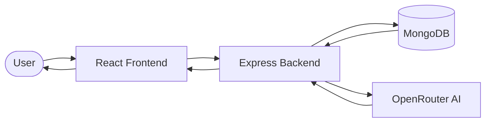
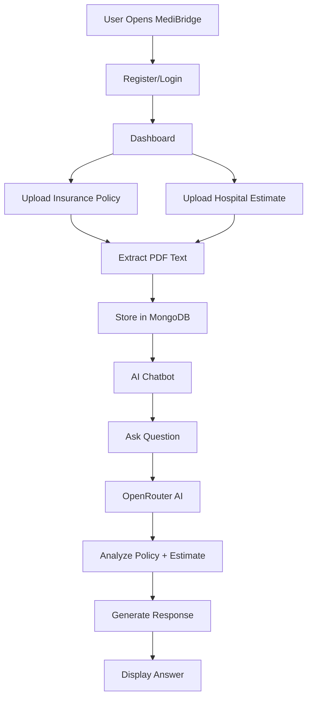
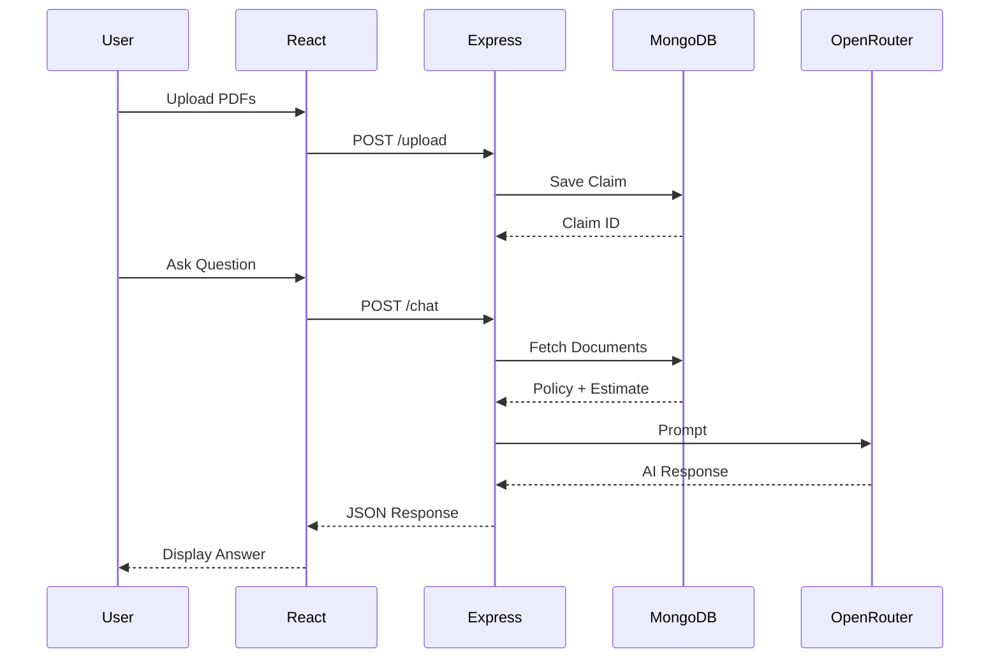
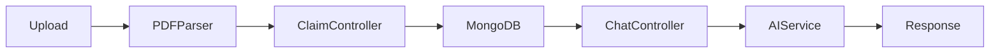
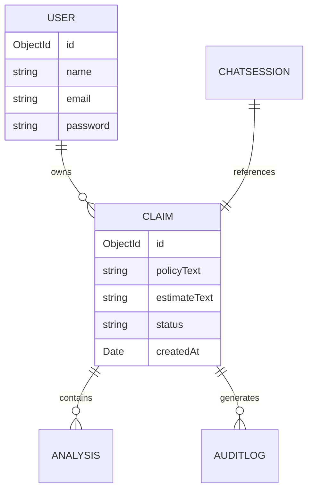

# 🏥 MediBridge AI
### AI-Powered Healthcare Insurance Claim Assistant


---

## 📖 Overview

Healthcare insurance claims are often difficult for patients to understand. Insurance policies contain lengthy legal terminology, while hospital estimates use complex medical language. This makes it challenging for patients to determine:

- Is this treatment covered?
- How much will insurance pay?
- How much do I have to pay?
- Why was a claim approved or rejected?

**MediBridge AI** bridges this gap by allowing users to upload their insurance policy and hospital estimate, after which an AI assistant answers claim-related questions in simple language.

---

# 🚨 Problem Statement

Healthcare insurance documentation is:

- Difficult to understand
- Filled with legal jargon
- Time-consuming to read
- Different for every insurance company
- Hard to compare against hospital bills

Patients often spend hours contacting insurance providers just to understand whether their treatment is covered.

---
**Live deployment link**-https://medi-bridge-ai.vercel.app/
# 💡 My Solution

MediBridge AI simplifies the insurance claim process by combining document processing with Generative AI.

Users simply:

1. Login
2. Upload Insurance Policy PDF
3. Upload Hospital Estimate PDF
4. Ask questions naturally

Example:

> "Is my knee replacement covered?"

The AI reads both uploaded documents, compares them, and provides a clear explanation with supporting evidence.

---

# ✨ Features

## 🔐 Authentication

- User Registration
- Secure Login
- JWT Authentication
- Protected Routes

---

## 📄 Smart Document Upload

- Upload Insurance Policy PDF
- Upload Hospital Estimate PDF
- PDF Text Extraction
- Cloud Storage Support
- MongoDB Storage

---

## 🤖 AI Insurance Assistant

- Context-aware chatbot
- Reads uploaded documents
- Explains policy clauses
- Answers natural language questions
- Coverage analysis
- Patient payment estimation

---

## 📊 Claim Analysis

- AI-powered claim analysis
- Coverage insights
- Missing document detection
- Risk assessment

---

## 📈 Analytics

- Claim statistics
- Analysis reports
- Dashboard insights

---

## 📝 Audit Logs

Every important action is recorded.

Examples:

- Login
- Upload
- AI Chat
- Claim Analysis

---

## 📱 Responsive Interface

- React Frontend
- Modern Dashboard
- Clean UI
- Mobile Friendly

---

# 🏗 System Architecture



---

# 🔄 User Flow



---

# 🤖 AI Workflow



---

# 📂 Backend Workflow



---

# 🗄 Database Design



---

# 📁 Project Structure

```
MediBridge/

│

├── src/

│ ├── pages/

│ ├── services/

│ └── components/

│

├── server/

│ ├── config/

│ ├── controllers/

│ ├── middlewear/

│ ├── models/

│ ├── routes/

│ ├── services/

│ └── utils/

│

└── README.md
```

---

# 🛠 Tech Stack

### Frontend

- React
- Vite
- React Router
- Axios

### Backend

- Node.js
- Express.js

### Database

- MongoDB Atlas
- Mongoose

### AI

- OpenRouter API
- Large Language Models

### File Processing

- pdf-parse
- Multer

### Authentication

- JWT
- bcrypt


---

# 🚀 Future Scope

- OCR for scanned PDFs
- Multi-language support
- Insurance comparison
- Automatic claim approval prediction
- Fraud detection
- Doctor recommendation engine
- Email notifications
- Mobile application

---

# 🎯 Impact

MediBridge AI helps:

- Patients understand insurance policies
- Reduce claim confusion
- Save time
- Improve transparency
- Make healthcare documentation accessible to everyone


# 📜 License

MIT License
